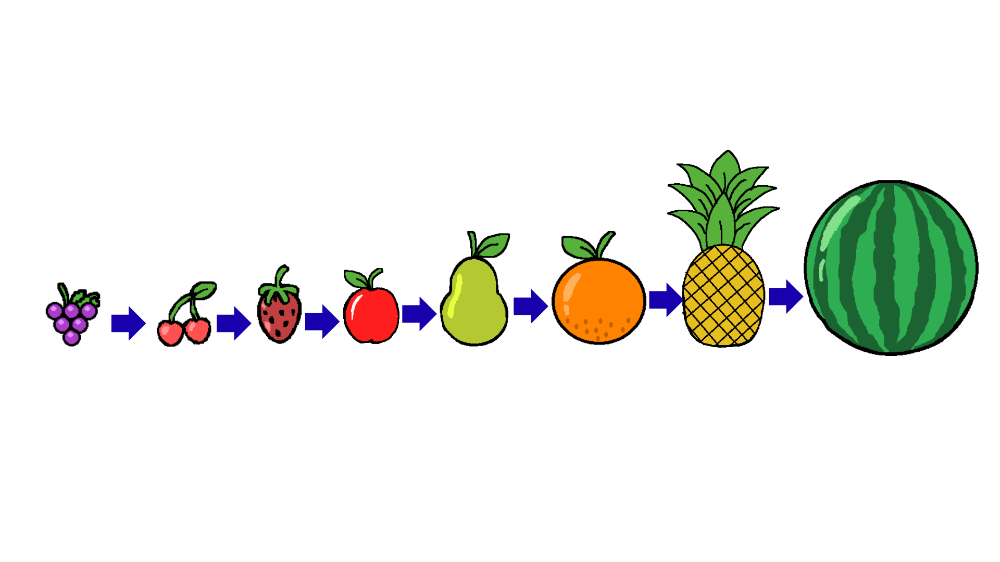

<center>


</center>

Um jogo onde o objetivo é juntar as frutas para formar uma melancia e ganhar pontos.

## Como jogar
O objetivo é juntar frutas até chegar em uma melancia:
1. Mova o mouse para posicionar a fruta.
2. Clique com o botão direito para soltar a fruta.
3. As frutas do mesmo tipo se fundem ao colidir e se tornam em uma fruta maior:

4. Fique atento, pois poderão aparecer alguns obstáculos:
    - Bomba: Se ela tocar em uma fruta, ela explode e destroi as frutas que estão ao redor dela
    - Cogumelo: Se ele tocar em uma fruta, ela fica podre e ela só volta à normalidade após jogar 10 frutas
    - Pimenta: Ao tocar em uma fruta, a fruta "pula"     
6. Se as frutas ultrapassarem o limite vermelho por mais de 3 segundos, você perde.

OBS: Aperte ESC durante o jogo para abrir o menu de pause.

## Como executar

1. Clone o repositório em sua máquina:

    ``` bash
    git clone --recurse-submodules https://github.com/RiosGabri/Watermelon_Game.git

    cd Watermelon_Game
    ```

### No Windows
2. Instale o MSYS2:

    Baixe através do [site oficial](https://www.msys2.org/) e instale no caminho padrão (`C:\msys64`).

    Após isso, abra a pasta onde foi instalado e abra o arquivo `ucrt64.exe`. Ao executá-lo, abrirá um terminal onde será necessário instalar as dependências (GCC e CMake) colocando esse comando:

    ```bash
    pacman -S mingw-w64-ucrt-x86_64-gcc mingw-w64-ucrt-x86_64-cmake
    ```
3. Compilar:
    ```bash
    mkdir build && cd build
    cmake .. -G "MinGW Makefiles"
    mingw32-make
    ```
4. Executar:
      ```bash
      Watermelon_Game.exe
      ```
### Em Linux
2. Instale as dependências (GCC e CMake):
    - Debian/Ubuntu
        ```bash
        sudo apt update && sudo apt install gcc cmake
        ```
    - Arch Linux
        ```bash
        sudo pacman -S gcc cmake
        ```

    - Fedora
        ```bash
        sudo dnf install gcc cmake
        ```
3. Compilar:
    ```bash
    mkdir build && cd build
    cmake ..
    make
    ```

4. Executar:
    ```bash
    Watermelon_Game
    ```
## Ferramentas usadas:
- C (linguagem de programação)
- Raylib (biblioteca de interface gráfica)
- Chimpunk2D (biblioteca para física do jogo)

## Equipe
<!-- ALL-CONTRIBUTORS-LIST:START - Do not remove or modify this section -->
<!-- prettier-ignore-start -->
<!-- markdownlint-disable -->
<table>
  <tbody>
    <tr>
      <td align="center" valign="top" width="14.28%"><a href="https://github.com/Torzinus"><br /><sub><b>Heitor de Carvalho</b></sub></a><br /><a href="https://github.com/RiosGabri/Watermelon_Game/commits?author=Torzinus" title="Code">💻</a></td>
      <td align="center" valign="top" width="14.28%"><a href="https://larissagiovanna.github.io/LarissaGiovanna/"><br /><sub><b>Larissa Giovanna</b></sub></a><br /><a href="https://github.com/RiosGabri/Watermelon_Game/commits?author=LarissaGiovanna" title="Code">💻</a></td>
      <td align="center" valign="top" width="14.28%"><a href="https://github.com/RiosGabri"><br /><sub><b>Gabriel Parméra</b></sub></a><br /><a href="https://github.com/RiosGabri/Watermelon_Game/commits?author=RiosGabri" title="Code">💻</a></td>
    </tr>
  </tbody>
</table>

<!-- markdownlint-restore -->
<!-- prettier-ignore-end -->
